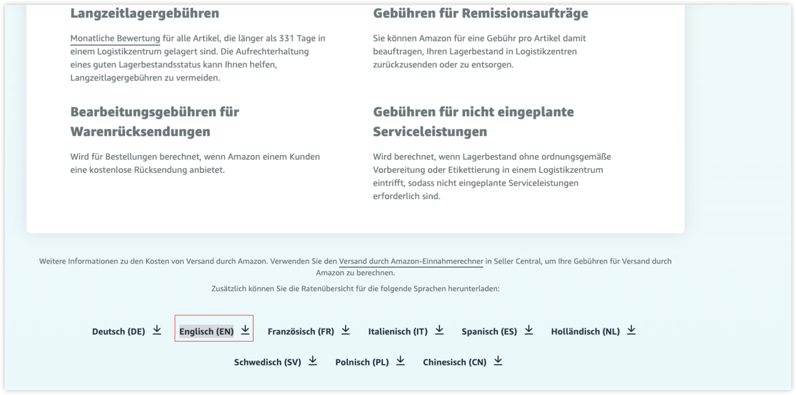

# Getting started

本应用单次执行时将检查[亚马逊卖家中心](https://sell.amazon.de/versand-durch-amazon?ref_=asde_soa_rd&)，判断FBA费率计算文档是否更新，如果更新则向指定人员发送邮件。


本应用通过配置文件进行参数的配置
*.fbaguard-share.yaml* 如下：
```yaml
amazon:
  # 文档标签 selector
  doc-selector: '#AS_SOA_DE_PR_MCF_FBA_UK_CARDS_I > div > a'
  # Amazon 销售中心
  seller-url: https://sell.amazon.de/versand-durch-amazon?ref_=asde_soa_rd&
  # 当前文档日期
  last-date: "221122"
mail:
  # 发件设置
  from:
    host: smtp.exmail.com
    password:
    port: 465
    user:
  # 收件人
  to:
    - test1@test.com
    - test2@test.com
  # 抄送：邮箱，名称
  cc:
    - cc@test.com,CC name
  subject: Amazon FBA Update Notification
  body: <b>Amazon的FBA费用计算文档已于 DOC_DATE 更新</b>，请尽快联系开发人员更新<b>品类费用计算器</b>。详情查看<a href="https://sell.amazon.de/versand-durch-amazon?ref_=asde_soa_rd&">Amazon销售中心</a>。查看文档请<a href="DOC_HREF">点击</a>。
```

部署时请复制`.fbaguard-share.yaml`到命令同一路径下`.fbaguard.yaml` 或通过参数`--config` 指定配置文件路径